<style>
.reveal h1, .reveal h2, .reveal h3 {
  word-wrap: normal;
  -webkit-hyphens: none;
  -moz-hyphens: none;
  hyphens: none;
}

.section .reveal .state-background{
  background-color: gray;
}

</style>

Comparative Phylogenetics in R
========================================================
date: 03 February, 2020
author: Hannah L. Owens
autosize: true
width: 1400
height: 1000
font-family: 'Futura'

</img>

Twitter Policy
========================================================
   
</img>
***
    
- Tweets are ok
- Attendance implies consent (wide-angle group shots)
- Asking permission before posting closer shots is just part of being a cool human.
- Our hashtag is #GLOBE_rWorkingGroup
- Hannah is @HannahOish; Maria is @marianovosolov

Introduction
========================================================
type: section


Introduction: The Plan
========================================================
  
- **Introduction**
- Loading and Plotting Phylogenies
- Character Data
- Calculating Phylogenetic Signal

Introduction: What R Cannot Do (On Its Own)
========================================================
incremental: true
- Phylogenetic inference
- Alignments
- BUT
- "ips" is a wrapper for all your favorites
  + raxml
  + mrbayes
  + beauti and BEAST
  + BayesTraits
  + TreeAnnotator
  + mafft and prank
  + gblocks and aliscore

***
</img>


Introduction: What R CAN Do!
========================================================
incremental: true
- Plotting
- Comparative phylogenetics
  + Modeling character evolution
  + Calculating phylogenetic signal
  + Ancestral character reconstruction
  + [And MUCH more](https://cran.r-project.org/web/views/Phylogenetics.html)!
    

***
</img>


Activity Dataset
========================================================
type: section

Activities: Anchovies
========================================================
   
<div align="left">
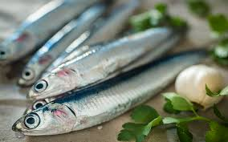
</div>
***
   
- Bloom *et al*. 2018. Evolution of body size and trophic position in migratory fishes: a phylogenetic comparative analysis of Clupeiformes (anchovies, herring, shad, and allies). *Biol. J. Linn. Soc.* 125: 302 - 314.
- Body size and trophic level from FishBase
- Anadromy from previous work, updated w/ new info

Activities: Anchovies
========================================================
   
<div align="left">

</div>
***
   
- Range from 2 to 40 cm
- Some freshwater, brackish, and marine
- Diadromous
  + Migrate between fresh and marine waters


The Plan
====================================
type: section

- Introduction    
- **Loading and Plotting Phylogenies**
- Character Data
- Calculating Phylogenetic Signal

Loading and Plotting Phylogenies
====================================
type: section

Loading and Plotting Phylogenies
========================================================

- Loading tree files
- Parts of tree files
- Displaying trees


Loading and Plotting Phylogenies
========================================================

The libraries we're using


```r
library(ape)
  #The Swiss army knife of comparative phylogenetics R packages
library(geiger)
  #A package for "macroevolutionary simulation and estimating parameters related to diversification"
library(phytools)
  #Very useful for visualization particularly, great blog support
```

Loading and Plotting Phylogenies : Loading Tree
========================================================

- Can read in a single tree or multiple trees.
- Takes ".tre" OR ".nex" nexus files
- You can also load in newick files with read.tree(). 


```r
istioTree <- read.nexus("Data/Fish_12Tax_time_calibrated.tre")
```

Loading and Plotting Phylogenies : Parts of tree files
========================================================


```r
istioTree
```

```

Phylogenetic tree with 12 tips and 11 internal nodes.

Tip labels:
	Istiompax_indica, Istiophorus_albicans, Istiophorus_platypterus, Kajikia_albida, Kajikia_audax, Makaira_nigricans, ...

Rooted; includes branch lengths.
```

```r
str(istioTree)
```

```
List of 4
 $ edge       : int [1:22, 1:2] 13 14 15 16 17 17 16 15 18 19 ...
 $ edge.length: num [1:22] 19.98 39.23 6.64 5.47 8.79 ...
 $ Nnode      : int 11
 $ tip.label  : chr [1:12] "Istiompax_indica" "Istiophorus_albicans" "Istiophorus_platypterus" "Kajikia_albida" ...
 - attr(*, "class")= chr "phylo"
 - attr(*, "order")= chr "cladewise"
```

Loading and Plotting Phylogenies : Parts of tree files
========================================================

What does the file look like?


```r
head(istioTree$edge) #Two columns, start node and end node/tip; tips labeled first
```

```
     [,1] [,2]
[1,]   13   14
[2,]   14   15
[3,]   15   16
[4,]   16   17
[5,]   17    3
[6,]   17    2
```

```r
head(istioTree$edge.length) #Gives lengths of branches by edge
```

```
[1] 19.976147 39.227748  6.635844  5.473333  8.786535  8.786535
```

Loading and Plotting Phylogenies : Parts of tree files
========================================================

What does the file look like?


```r
istioTree$tip.label #Gives a list of tip labels, order corresponds to edge number
```

```
 [1] "Istiompax_indica"           "Istiophorus_albicans"      
 [3] "Istiophorus_platypterus"    "Kajikia_albida"            
 [5] "Kajikia_audax"              "Makaira_nigricans"         
 [7] "Tetrapturus_angustirostris" "Tetrapturus_belone"        
 [9] "Tetrapturus_georgii"        "Tetrapturus_pfluegeri"     
[11] "Trachurus_trachurus"        "Xiphias_gladius"           
```

```r
is.ultrametric(istioTree) #Checks to see if the tree is ultrametric
```

```
[1] TRUE
```

Loading and Plotting Phylogenies : Displaying trees
========================================================

The basics


```r
plot(istioTree, cex = 4) #Basic view (phylogram)
nodelabels(cex = 4)
```

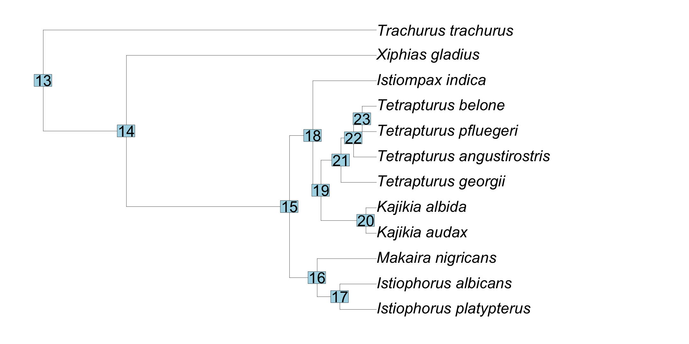

Loading and Plotting Phylogenies : Searching trees
========================================================

Finding tips that match  
- not specific to comparative phylogenetics  


```r
colors <- c("black", "red")
matches <- grep("Kajikia", istioTree$tip.label, value = T)
matches
```

```
[1] "Kajikia_albida" "Kajikia_audax" 
```

Loading and Plotting Phylogenies : Searching trees
========================================================

Highlighting matching taxa


```r
plot(istioTree, cex = 4, 
     tip.col = ifelse(istioTree$tip.label %in% matches,
                      'red','black'))
```

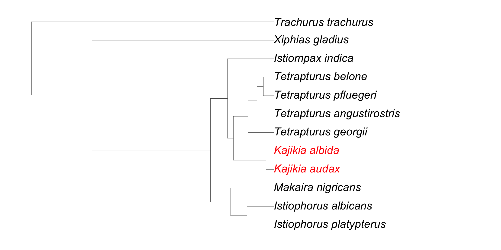

Loading and Plotting Phylogenies : Searching trees
========================================================

Finding the node with a most-recent common ancestor.


```r
#Remember, these are our matches
matches
```

```
[1] "Kajikia_albida" "Kajikia_audax" 
```

```r
#What is the node number?
findMRCA(tree = istioTree, tips = matches, type = "node")
```

```
[1] 20
```

Challenge 1: Load and Display a Tree
========================================================
type: prompt

We have given you a phylogeny of clupeiform fishes from 
[Bloom and Lovejoy, 2014](https://royalsocietypublishing.org/doi/full/10.1098/rspb.2013.2081). Load it into R and display the tree. The file is called "Clupeiform phylogeny.nex".

Bonus challenge: Which node number represents the most
recent common ancestor for the *Anchoa* clade?

Challenge 1: Load and Display a Tree
========================================================
type: prompt

The node of the *Anchoa* MRCA is 178.


```r
anchovyTree <- read.nexus("Data/Clupeiform phylogeny.nex")
matches <- grep("Anchoa", anchovyTree$tip.label, value = T)
plot(anchovyTree, cex = 0.5, 
     tip.col = ifelse(anchovyTree$tip.label %in% matches,'red','black'))
findMRCA(tree = anchovyTree, tips = matches, type = "node")
```

```
[1] 178
```

```r
nodelabels(node = 178, text = "MRCA", bg = F, col = "red")
```

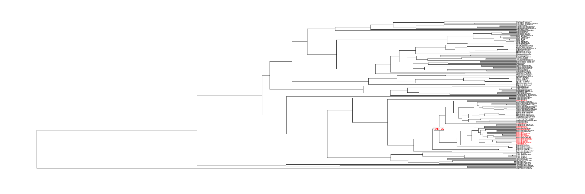

Loading and Plotting Phylogenies : Displaying trees
========================================================

Getting fancy...


```r
plot(istioTree, type = "cladogram", use.edge.length = F, 
     edge.width = 2, font = 4, cex = 2.5)
```

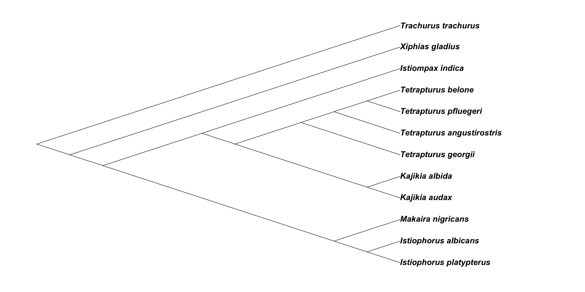

Loading and Plotting Phylogenies : Displaying trees
========================================================

Getting fancy...


```r
plot(istioTree, type = "fan", rotate.tree = 30, 
     main = "Phylogeny of Billfishes", cex.main = 3.5, 
     label.offset = 2, cex = 2.5, 
     tip.color = c("blue", "red", "red", "yellow2",
                   "yellow2", "orange1", "chartreuse4", 
                   "chartreuse4", "chartreuse4", 
                   "chartreuse4", "black", "purple"))
```

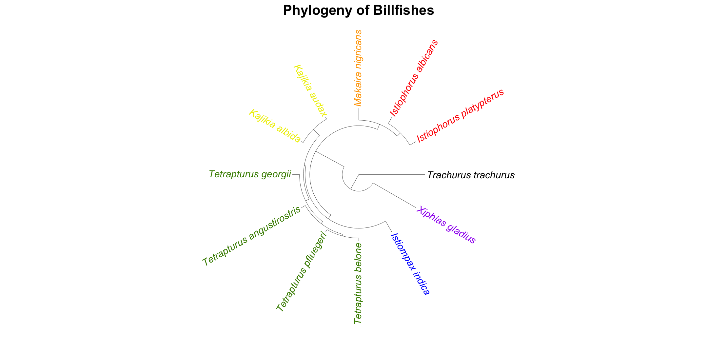

Challenge 2: Make Your Own "Fancy" Tree
========================================================
type: prompt

Try to imitate this tree. It is a subset of the anchovy tree trimmed using extract.clade() like this:
`subsetAnchovyTree <- extract.clade(anchovyTree, node = 160)`.
Use `?ape::plot.phylo()` for help.

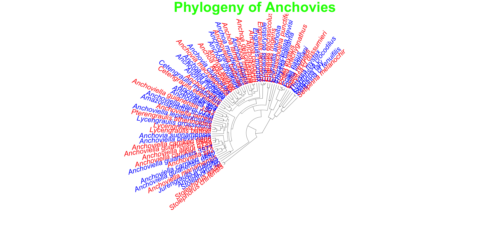

Challenge 2: Make Your Own "Fancy" Tree
========================================================
type: prompt

Here's how I made that tree. How'd you do?


```r
subsetAnchovyTree <- extract.clade(anchovyTree, node = 160)
plot(subsetAnchovyTree, type = "fan", rotate.tree = 45, open.angle = 180, 
     main = "Phylogeny of Anchovies", cex.main = 5, col.main = "green",
     label.offset = 2, cex = 2.5, tip.color = c("blue", "red"))
```


The Plan
====================================
type: section

- Introduction
- Loading and Plotting Phylogenies
- **Character Data**
- Calculating Phylogenetic Signal


Character Data
====================================
type: section

Character Data
====================================

- Loading data
- Uniting with tree
- Plotting on tree

Character Data : Loading data
========================================================

Multiple characters in a .csv file


```r
characterTable <- read.csv("Data/CodingTableThresh95.csv", row.names = 1)
characterTable[,1:4] #Showing the data
```

```
                           bathmin bathmax SSSmin SSS8max
Istiompax_indica             -7000    -485   3416    3651
Istiophorus_albicans         -6275      -1   3393    3741
Istiophorus_platypterus      -7272      -1   3359    3639
Kajikia_albida               -5750   -1267   3561    3681
Kajikia_audax                -7000      -1   3451    3638
Makaira_nigricans            -5750   -1107   3437    3694
Tetrapturus_angustirostris   -7000    -841   3425    3649
Tetrapturus_belone           -1950     -95   3677    3800
Tetrapturus_georgii          -6414   -3392   3458    3741
Tetrapturus_pfluegeri        -6693   -2112   3437    3741
Xiphias_gladius              -6738    -748   3337    3748
```

Character Data : Union with tree
========================================================

Combining the tree and the character data


```r
treeWData <- treedata(istioTree, characterTable, sort = T)
```

```
Warning in treedata(istioTree, characterTable, sort = T): The following tips were not found in 'data' and were dropped from 'phy':
	Trachurus_trachurus
```

```r
  #Trims out taxa that are missing from the tree or the character table
```

Character Data : Union with tree
========================================================

Original tree versus trimmed tree

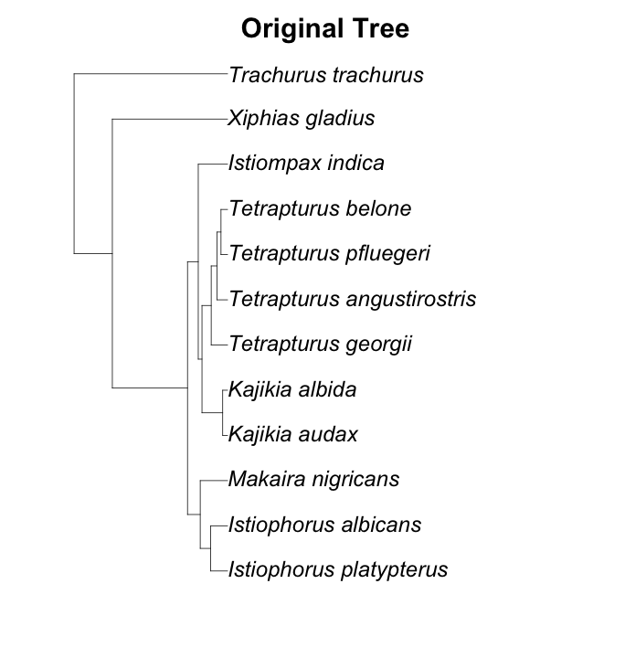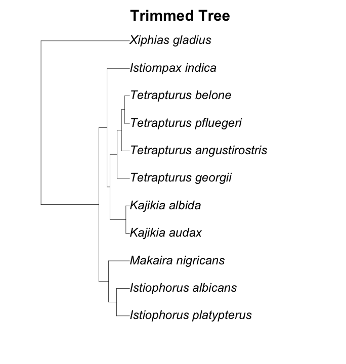

Character Data : Union with tree
========================================================

Combining the tree and the character data


```r
knitr::kable(treeWData$data[,1:4]) #Here's the data
```


|                           | bathmin| bathmax| SSSmin| SSS8max|
|:--------------------------|-------:|-------:|------:|-------:|
|Istiompax_indica           |   -7000|    -485|   3416|    3651|
|Istiophorus_albicans       |   -6275|      -1|   3393|    3741|
|Istiophorus_platypterus    |   -7272|      -1|   3359|    3639|
|Kajikia_albida             |   -5750|   -1267|   3561|    3681|
|Kajikia_audax              |   -7000|      -1|   3451|    3638|
|Makaira_nigricans          |   -5750|   -1107|   3437|    3694|
|Tetrapturus_angustirostris |   -7000|    -841|   3425|    3649|
|Tetrapturus_belone         |   -1950|     -95|   3677|    3800|
|Tetrapturus_georgii        |   -6414|   -3392|   3458|    3741|
|Tetrapturus_pfluegeri      |   -6693|   -2112|   3437|    3741|
|Xiphias_gladius            |   -6738|    -748|   3337|    3748|

Challenge 3: Uniting anchovy characters with the tree
========================================================
type: prompt

You've already read in the anchovy phylogeny. Now read in 
the character table, Bloom_etal_2018_Reduced_Dataset.csv,
from [Bloom *et al*., 2018](https://doi.org/10.1093/biolinnean/bly106).

How many taxa are represented in the phylogeny *and* the
character dataset?

Challenge 3: Uniting anchovy characters with the tree
========================================================
type: prompt


```r
anchovyCharacters <- read.csv(file = "Data/Bloom_etal_2018_Reduced_Dataset.csv", 
                              row.names = 1)
anchovyTreeWData <- treedata(anchovyTree, anchovyCharacters, sort = T);
plot(anchovyTreeWData$phy, main = "Anchovies!")
paste0("There are ", nrow(anchovyTreeWData$data), " taxa represented in both datasets.")
```

```
[1] "There are 50 taxa represented in both datasets."
```

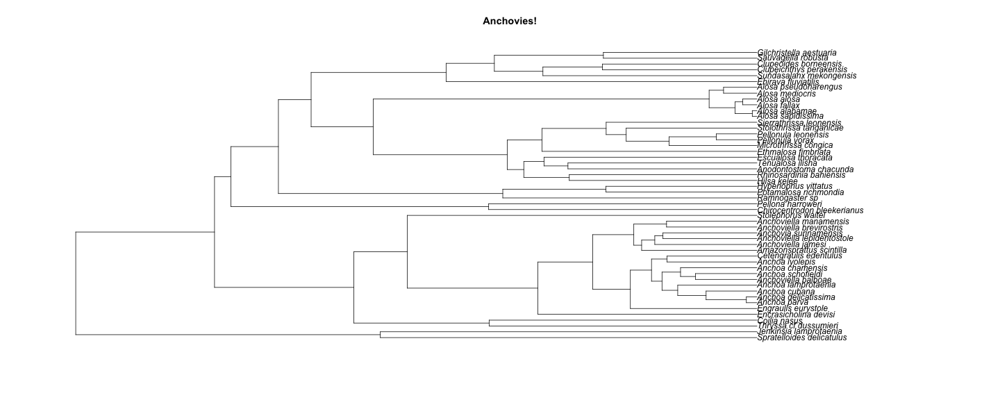

Plotting Characters on Trees
===============================================================
type: section

Plotting Characters on Trees
====================================
- Discrete traits
- Continuous traits

Plotting Characters on Trees: Discrete traits
===============================================================
Plotting discrete traits on tips.


```r
library(RColorBrewer) # Accessory package with better color

#Entering in discrete tip values
discChar <- c(1, 1, 1, 3, 3, 1, 2, 2, 2, 2, 1)

#Plotting
plot(treeWData$phy, main = "Preferred prey", cex.main = 4, 
     label.offset = 2.5, no.margin = F, cex = 3)

#Setting up colors.
reconCol <- brewer.pal(3, "RdYlBu")

#Plot tips
tiplabels(text = rep(" ", 11), tip = seq(1,11,1), cex = 3, 
          frame = "circle", bg = reconCol[discChar])

#Plot legend
legend(x = 0, y = 5, fill = reconCol, bty = "n", cex = 3, 
       legend = c("Sardines", "Pompano", "Hamburgers"))
```

Plotting Characters on Trees: Discrete traits
===============================================================
Plotting discrete traits on tips.

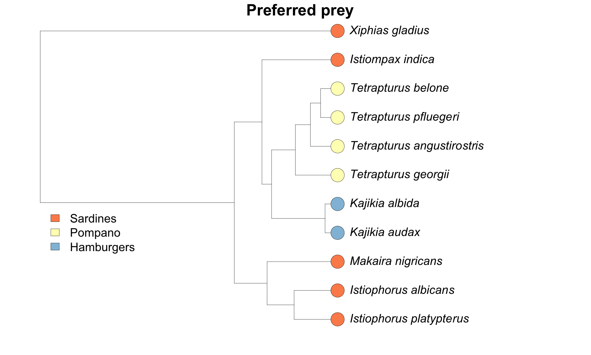

Challenge 4: Plotting anchovy characters on the tree
========================================================
type: prompt

You have a tree united with characters. It's plotting time!

Your challenge: Color-code the tip labels according to whether a species is diadromous or not.


Challenge 4: Plotting anchovy characters on the tree
========================================================
type: prompt


```r
# Set up colors
labelCols <- c("red", "blue");
diadLabs <- labelCols[as.factor(anchovyTreeWData$data[,3])]

#Plotting
plot(anchovyTreeWData$phy, main = "Diadromy", cex.main = 4, 
     no.margin = F, cex = 3, 
     label.offset = 2.5)

tiplabels(text = rep(" ", length(anchovyTreeWData$phy$tip.label)), 
          cex = 1, frame = "circle", bg = diadLabs)

#Plot legend
legend(x = 0, y = 50, bty = "n", cex = 2, 
       fill = labelCols, 
       legend = c("Diadromous", "Non-diadromous")
```

Challenge 4: Plotting anchovy characters on the tree
========================================================
type: prompt

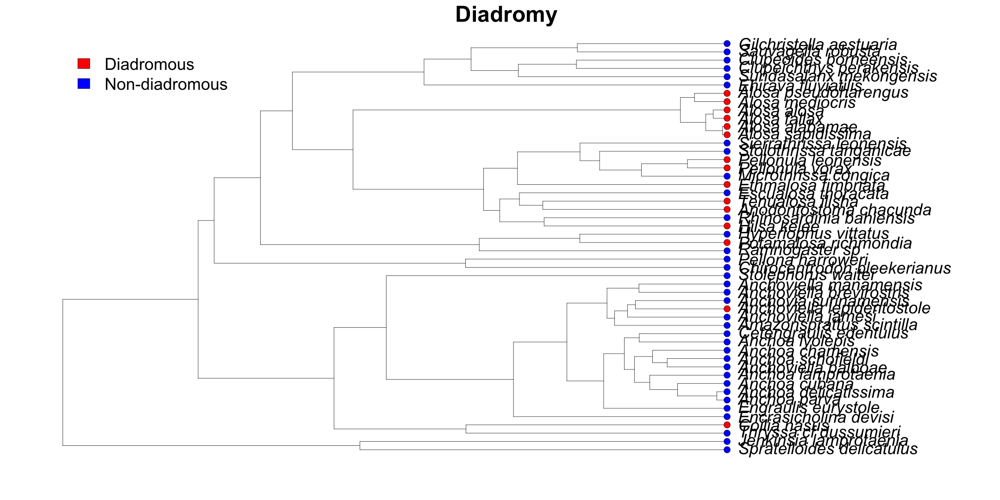

Plotting Characters on Trees: Continuous traits
===============================================================
Plotting continuous characters using a color gradient


```r
library(plotrix); #Contains a useful way of producing a color legend

#Set up colors and assigning values
colPal <- brewer.pal(9, "Reds")
normedTips <- round((treeWData$data[,8]-min(treeWData$data[,8]))/
                           (max(treeWData$data[,8])-min(treeWData$data[,8]))*8,0)
reconCol <- colPal[normedTips+1]
reconCol
```

```
 [1] "#FB6A4A" "#FC9272" "#FC9272" "#FEE0D2" "#FC9272" "#FEE0D2" "#FB6A4A"
 [8] "#FFF5F0" "#FEE0D2" "#FCBBA1" "#67000D"
```


Plotting Characters on Trees: Continuous traits
===============================================================
Plotting continuous characters using a color gradient


```r
# Do the plot
plot(treeWData$phy, main = "Niche breadth", label.offset = 2.5, 
     no.margin = F)

#Label Tips
tiplabels(text = rep(" ", 11), seq(1,11,1), 
          cex = 0.65, frame = "circle", bg = reconCol[1:11])

#Making a key for the plot
col.labels<-c("Narrow", "Broad")
color.legend(11,0,13,4, col.labels, 
             colPal,gradient="y") #Numbers are plot coordinates
```

Plotting Characters on Trees: Continuous traits
===============================================================
Plotting continuous characters using a color gradient

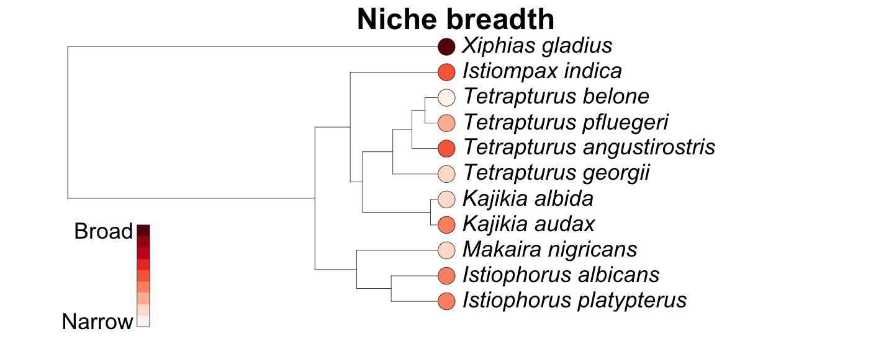

Challenge 5: Plotting continuous anchovy characters on the tree
========================================================
type: prompt

You guessed it. Time for a continuous character plot.

Your challenge: Color-code the tip labels according to log body size.

Bonus challenge: Add another tip label showing trophic position.
(Hint: check out `?tiplabels()`)

Challenge 5: Plotting continuous anchovy characters on the tree
========================================================
type: prompt


```r
# Set up colors
logBody <- as.numeric(anchovyTreeWData$data[,1])
colPalBody <- rev(brewer.pal(9, "Reds"))
normedTipsB <- round((logBody-min(logBody))/
                           (max(logBody)-min(logBody))*8,0)
tipColBody <- colPalBody[normedTipsB+1]

trophPos <- as.numeric(anchovyTreeWData$data[,2])
colPalTroph <- rev(brewer.pal(9, "Blues"))
normedTipsT <- round((trophPos-min(trophPos))/
                           (max(trophPos)-min(trophPos))*8,0)
tipColTroph <- colPalTroph[normedTipsT+1]
```

Challenge 5: Plotting continuous anchovy characters on the tree
========================================================
type: prompt


```r
#Plotting
plot(anchovyTreeWData$phy, main = "Body Size and Trophic level", 
     cex.main = 4, no.margin = F, cex = 3, label.offset = 5)

tiplabels(cex = 3, adj = 1, pch = 21, bg = tipColBody)

tiplabels(cex = 3, adj = 3.5, pch = 21, bg = tipColTroph)

#Making keys for the plot
col.labels<- round(c(min(
  as.numeric(anchovyTreeWData$data[,1])), 
  max(as.numeric(anchovyTreeWData$data[,1]))),2)
text(5,46, "Body Size", cex = 3)
color.legend(0,40,4,44,col.labels,rev(colPalBody),
             gradient="y", cex = 3, align = "rb")

col.labels<-round(c(min(
  as.numeric(anchovyTreeWData$data[,2])), 
  max(as.numeric(anchovyTreeWData$data[,2]))),2)
text(5,36, "Trophic Level", cex = 3)
color.legend(0,30,4,34,col.labels,rev(colPalTroph),
             gradient="y", cex = 3, align = "rb")
```

Challenge 5: Plotting continuous anchovy characters on the tree
========================================================
type: prompt

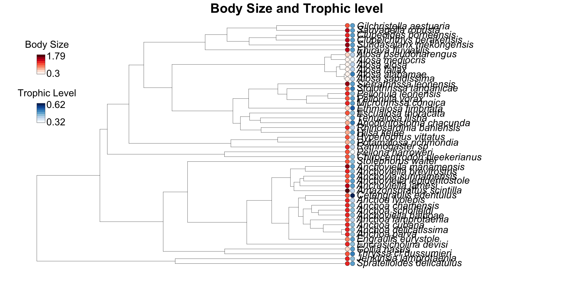

The Plan
====================================
type: section

- Introduction    
- Loading and Plotting Phylogenies
- Character Data
- Modeling Character Evolution
- **Calculating Phylogenetic Signal**


Calculating Phylogenetic Signal
====================================
type: section

Calculating Phylogenetic Signal
====================================

- The basic function
- Setting up for the loop
- The loop
- The results

Phylogenetic signal: The basic function
===============================================================

- Can evaluate Pagel's Lambda or Blomberg's K
- Lambda: scaling for correlations between species relative to correlation expected under Brownian evolution
- K: scaled ratio of among-species variance to contrasts variance 


```r
phytools::phylosig(treeWData$phy, x=treeWData$data[,1],method = "K")
```

```
[1] 0.1342713
```

Phylogenetic signal: Setting up for the loop
===============================================================


```r
sigTable <- matrix(data = NA, ncol = 4, nrow = ncol(treeWData$data))
rownames(sigTable) <- colnames(treeWData$data)
colnames(sigTable) <- c("Lambda", "Lambda P-value", "K", "K P-value")
```

Phylogenetic signal: The loop
===============================================================
Pagel's Lambda, Blomberg's K, and their respective P-values for each character


```r
count <- 1
while(count <= ncol(treeWData$data)){
  temp <- phytools::phylosig(treeWData$phy, treeWData$data[,count], 
                             method = "lambda", test = T); #Calculate Pagel's lambda
  sigTable[count,1] <- temp$lambda
  sigTable[count,2] <- temp$P
  temp <- phytools::phylosig(treeWData$phy, treeWData$data[,count], 
                             method = "K", test = T); #Calculate Blomberg's k
  sigTable[count,3] <- temp$K
  sigTable[count,4] <- temp$P
  count <- count + 1
}
```

Phylogenetic signal: The results
===============================================================
Et voila!


```r
knitr::kable(sigTable)
```


|           |    Lambda| Lambda P-value|         K| K P-value|
|:----------|---------:|--------------:|---------:|---------:|
|bathmin    | 0.0000690|      1.0000000| 0.1342713|     0.821|
|bathmax    | 0.0000690|      1.0000000| 0.1958716|     0.706|
|SSSmin     | 0.0000675|      1.0000000| 0.2386497|     0.535|
|SSS8max    | 0.0000690|      1.0000000| 0.2418311|     0.537|
|SST13min   | 0.6574920|      0.5737320| 0.4547630|     0.100|
|SST13max   | 0.0000690|      1.0000000| 0.1375421|     0.783|
|tempRange  | 0.0000522|      1.0000000| 0.4011244|     0.150|
|nicheRange | 0.7364686|      0.1068847| 0.8079658|     0.065|
|Diet       | 1.0438822|      0.0000795| 1.1791841|     0.002|

Challenge 5: Anchovy character evolution
========================================================
type: prompt

What is the phylogenetic signal for log body size and trophic position in anchovies?

Challenge 5: Anchovy phylogenetic signal
========================================================
type: prompt

Step 1: Set up the data and table for results. 

```r
# Data
chovyCharTab <- cbind(as.numeric(anchovyTreeWData$data[,1]),as.numeric(anchovyTreeWData$data[,2]))
rownames(chovyCharTab) <- rownames(anchovyTreeWData$data)
colnames(chovyCharTab) <- colnames(anchovyTreeWData$data)[1:2]

#Set up a table for results
sigTable <- matrix(data = NA, ncol = 4, nrow = ncol(chovyCharTab))
rownames(sigTable) <- colnames(chovyCharTab)
colnames(sigTable) <- c("Lambda", "Lambda P-value", "K", "K P-value")
```

Challenge 5: Anchovy phylogenetic signal
========================================================
type: prompt

Step 2: Loop through each column. 

```r
#Loop to calculate Blomberg's K and P-value for each character
count <- 1
while(count <= ncol(chovyCharTab)){
  temp <- phytools::phylosig(anchovyTreeWData$phy, chovyCharTab[,count], 
                             method = "lambda", test = T); #Calculate Pagel's lambda
  sigTable[count,1] <- temp$lambda
  sigTable[count,2] <- temp$P
  temp <- phytools::phylosig(anchovyTreeWData$phy, chovyCharTab[,count], 
                             method = "K", test = T) #Calculate Blomberg's k
  sigTable[count,3] <- temp$K
  sigTable[count,4] <- temp$P
  count <- count + 1
}
```


Challenge 5: Anchovy phylogenetic signal
========================================================
type: prompt

Step 3: How'd we do? 

```r
knitr::kable(sigTable)
```


|                 |    Lambda| Lambda P-value|         K| K P-value|
|:----------------|---------:|--------------:|---------:|---------:|
|logbodysize      | 0.9954688|              0| 0.7099999|     0.001|
|trophic_position | 0.0000519|              1| 0.1009663|     0.807|

Further Reading
====================================
type: section

Further Reading
========================================================

Analysis of Phylogenetics and Evolution with R
* By Emmanuel Paradis
  + Lead author of ape package
* http://ape-package.ird.fr/APER.html

Phytools
* Another CompPhy R package popularly used
* http://blog.phytools.org/
 
